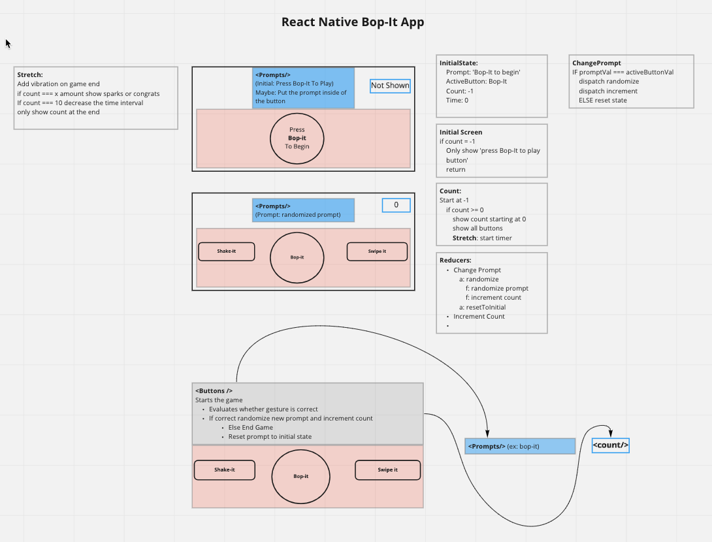

# Bop-it

### Authors
- Chris Bortel
- Jonathon Lee

## User Stories
- As a user I want to be able to play a bop-it based game on my phone with native gestures

- I want to be prompted to perform a certain action (bop-it, swipe-it, shake-it, etc.)
  - Prompts should me randomized
  - Only after performing correct action I want to receive another prompt

- I want to be able to track my current correct actions

- I want to be able to use the phone to swipe, bop, and shake in order to move me onto the next prompt

## Technical Requirements 


Write an ``App`` component that serves as the container for all sub-components of this application
  - A ``<Header>`` component which shows the Title of the app and the ``<Counter />``
  - A ``<GameView>`` component which shows the components
  - A ``<Play>`` component
    - Displays game prompt
    - Displays game interactive components
    - Has game logic
      - Buttons/Gestures trigger game to start, triggers new prompts, increments counter
  - ``<Button>``
    - Start Game
    - Dispatches an action to randomize prompt when gesture is correct
    - Randomize
    - Track correct gesture and dispatch increment action to ``counter``
    
  - A ``<Counter>`` component
    - Keeps score.    
### What we need ?
Game Plan:
- redux
  - index.js
  - gameReducer.js
- gameFront.js
  - wire 


- Static buttons and a way to change the state
- Randomizer that changes the prompt on correct gesture
  - Where should the gesture be connected to the prompts? --- on correct gesture, we want to tell the prompt to change. 
  - STRETCH: Limit the number of repeat prompts

  - Button: Should we call the action of this to be 'changePrompt'?
    - On change, increment counter up one

  - Q: Where will will we handle the vibrate? Buttons?

## UML 


```
<App>
  <GameView>
    <Play>
    <Button>
    <Counter>
  </GameView>
</App>
  Initial State
    s:prompt === BopIt to begin
    s:buttonDisplay === Bop-it
    s:button === Bop-it
    s:count === -1
    
    a:setButtons
    a:changePrompt
      f:randomize
      f:increment
    a:reset to initial 

    <gamebuttoin 
    - dispatches action with value of button
    - reducer check for what value will be 


Redux Store:
  - Reducers


    
    
    
    
    
    
    
    
    
    
    
    
    
    
    
    
    
    
    
    
    
    
    
    
    
    
    
    
    
    
    <Prompt />
    // Displays prompts
      - s: initialState --- Press 'Bop-It' to begin
      - s: currentPrompt
      <!-- - a: changePrompt -->
      - a: 

    <Button />
    // Handles the logic of gestures and triggers prompts to change
      - s: nonActiveButton
      - s: activeButton
      - a: changePrompt 
      - a: incrementScore

    <Counter />
    // Tracks users score
      - s: score:0

```
## Pull Requests Url
- [Scaffolding](https://github.com/Chris-Bortel-401-advanced-javascript/bop-it/pull/2)


- Pseudo For Buttons
// If count negative 1 render start screen 
// otherwise render game buttons
//if correct do the increment
// on game button if incorrect, set count -1, display you lose